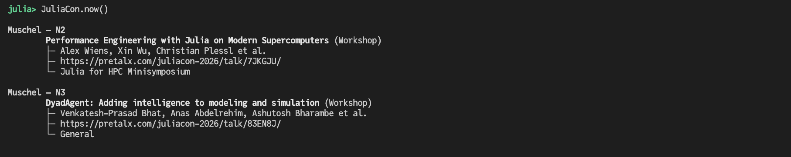
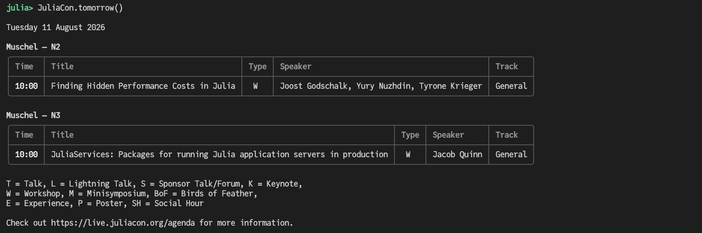
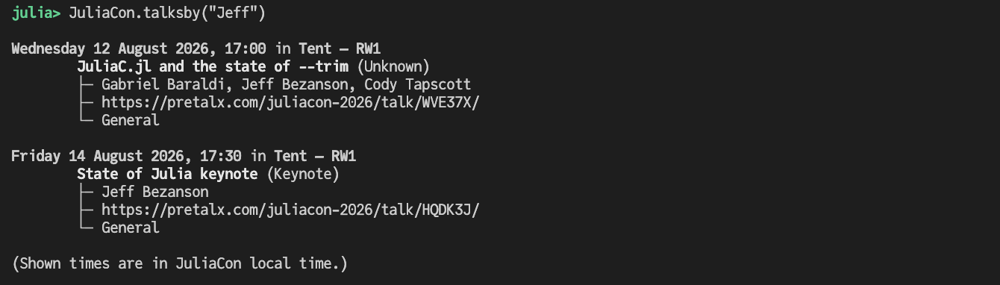
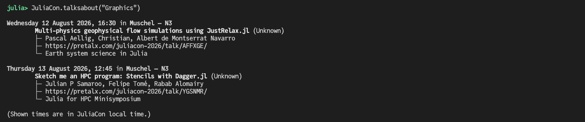

# JuliaCon.jl

[](https://github.com/JuliaCon/JuliaCon.jl/actions)
[](https://codecov.io/gh/JuliaCon/JuliaCon.jl)
[](https://github.com/invenia/BlueStyle)


Access the JuliaCon schedule from your terminal.

## Live schedule

```julia
JuliaCon.now()
```


```julia
JuliaCon.today()
```


```julia
JuliaCon.tomorrow()
```



### Terminal links

Wouldn't it be nice if one could click on talk titles in the schedule table and jump to the webpage of the respective talk? Some terminals, such as iTerm2 and GNOME Terminal, support the displaying of [terminal-hyperlinks](https://gist.github.com/egmontkob/eb114294efbcd5adb1944c9f3cb5feda) (clickable without printing the URL). We use this terminal feature to indeed make the talk titles clickable! The only thing you need to do is call `JuliaCon.today(; terminal_links=true)`. If you like what you see, you can use `JuliaCon.set_terminallinks(true)` to set a permanent default.

### Time zones

Utilizing [TimeZones.jl](https://github.com/JuliaTime/TimeZones.jl), we try to respect your local time zone and try to convert all the JuliaCon UTC times appropriately. By default, we will use `TimeZones.localzone()` to figure out your local time zone. But you can also manually set your time zone via `set_local_timezone(tz::AbstractString)`. Note that you need to restart Julia to see the effect of the change.

### Caching

When it is needed, the package fetches the JuliaCon schedule (`schedule.json`) from the [JuliaConDataArchive](https://github.com/JuliaCon/JuliaConDataArchive) and keeps the information in memory for further usage. Hence, by default, the fetching happens once per Julia session. To force an update of the JuliaCon schedule you can call `update_schedule()`.

If fetching the `schedule.json` takes longer than 5 seconds - you can change this default via `JuliaCon.set_timeout(secs)` - the package will fall back to using the last cached version (which might be stale).

As per default, the location of the cache is `.julia/datadeps/JuliaConSchedule`. You can use `JuliaCon.set_cachedir(path)` to change this default.

#### Cache modes

There are three cache modes: `:DEFAULT`, `:NEVER`, `:ALWAYS`. You can switch between them by calling `JuliaCon.set_cachemode(mode)` appropriately.

* `:DEFAULT`: As described above: tries to download / update the schedule and falls back to the cache if necessary.
* `:NEVER`: The cache will never be used / created. If the download fails it fails.
* `:ALWAYS`: Always use the cached `schedule.json`. Never attempts to download / update it.

### Testing / Debugging

* `JuliaCon.debugmode(on::Bool)`: Simulates that we are live / in the middle of JuliaCon.
* `JuliaCon.set_json_src(src::Symbol)`: Anticipated input: `:pretalx`, `:github` ([JuliaConDataArchive](https://github.com/JuliaCon/JuliaConDataArchive))

## Search for talks by speaker

```julia
JuliaCon.talksby("Jeff")
```




## Search for talks by title/abstract
```julia
JuliaCon.talksabout("Graphics")
```



